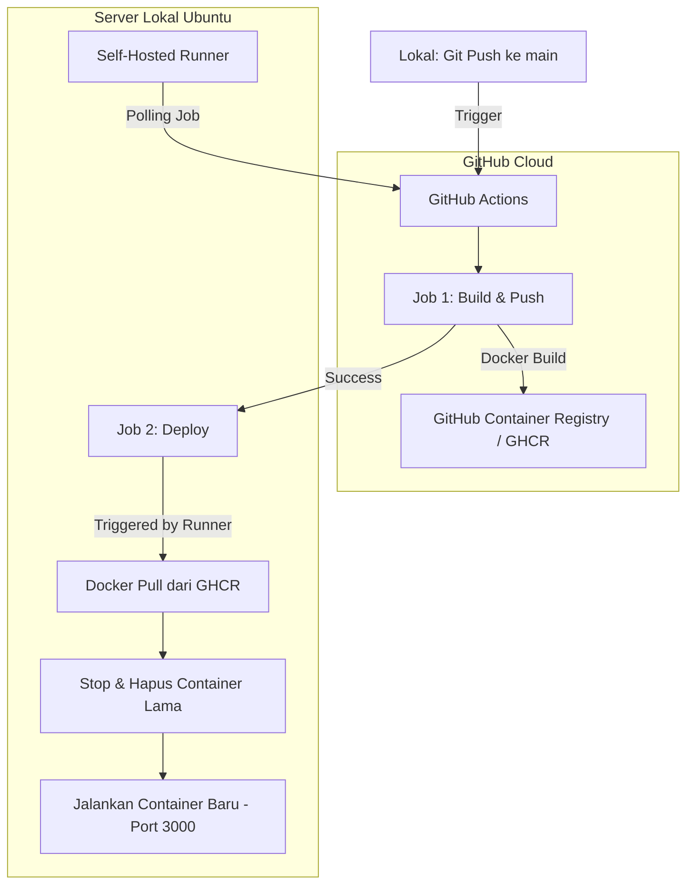

# 🚀 Express.js CI/CD dengan GitHub Actions & Self-Hosted Runner

[](https://github.com/features/actions)
[](https://www.docker.com/)
[](https://expressjs.com/)
[](https://pm2.keymetrics.io/)

Repositori ini berisi aplikasi web **Express.js** sederhana yang dikonfigurasi dengan alur **CI/CD (Continuous Integration / Continuous Deployment)** otomatis menggunakan **GitHub Actions** dan **Self-Hosted Runner**.


---

## 🛠️ Alur Arsitektur CI/CD



1. **Build & Push (`ubuntu-latest`):**
   * Diaktifkan setiap kali ada *push* ke branch `main`.
   * Melakukan *checkout* kode, masuk ke GitHub Container Registry (`ghcr.io`), membangun (*build*) image Docker berdasarkan `Dockerfile`, dan mengunggahnya ke GHCR.
2. **Deploy (`self-hosted`):**
   * Berjalan pada mesin server lokal (VirtualBox/Ubuntu) yang menjalankan **Self-Hosted Runner** aktif.
   * Menarik (*pull*) image Docker terbaru dari GHCR, menghentikan container lama yang sedang berjalan (`github-ci-container`), menghapusnya, dan menjalankan container baru di port `3000`.

---

## ⚙️ Langkah Konfigurasi Self-Hosted Runner di Server Lokal

Untuk menjalankan proses *deploy* secara lokal, ikuti langkah berikut:

### 1. Hubungkan Runner ke GitHub
1. Masuk ke halaman repositori Anda di GitHub.
2. Buka menu **Settings** > **Actions** > **Runners**.
3. Klik tombol **New self-hosted runner** dan pilih sistem operasi server Anda (misal: **Linux**, arsitektur **X64**).
4. Ikuti instruksi perintah yang tertera di sana untuk mengunduh, mengonfigurasi, dan menghubungkan runner pada server Ubuntu Anda.

### 2. Jalankan Runner sebagai Background Service
Agar runner tetap berjalan di latar belakang meskipun sesi SSH/terminal ditutup, instal runner sebagai *service*:
```bash
sudo ./svc.sh install
sudo ./svc.sh start
```
Untuk memeriksa status layanan runner:
```bash
sudo ./svc.sh status
```

---

## 📦 Menjalankan Proyek secara Manual

Jika Anda ingin menjalankan atau menguji aplikasi ini secara lokal tanpa melalui alur CI/CD, gunakan salah satu metode berikut:

### Metode A: Menggunakan Node.js Secara Langsung
1. Pastikan Anda memiliki Node.js terinstal, lalu jalankan:
   ```bash
   npm install
   ```
2. Jalankan aplikasi:
   ```bash
   npm start
   ```
3. Buka browser Anda dan akses `http://localhost:3000`.

### Metode B: Menggunakan Docker Lokal
1. Build image Docker secara lokal:
   ```bash
   docker build -t github-ci-local .
   ```
2. Jalankan container:
   ```bash
   docker run -p 3000:3000 --name github-ci-container-local -d github-ci-local
   ```
3. Akses aplikasi melalui `http://localhost:3000`.

---

## 📂 Struktur Berkas Proyek

```text
github-ci/
│
├── .github/workflows/
│   └── deploy.yml      # Definisi Pipeline CI/CD (GitHub Actions)
│
├── bin/
│   └── www             # Entry Point Server HTTP Express
├── public/             # Berkas Statis (CSS, JS, Gambar)
├── routes/             # Rute URL Aplikasi (index, users)
├── views/              # Template Tampilan EJS (index.ejs, error.ejs)
│
├── app.js              # Inisialisasi Express Application
├── Dockerfile          # Instruksi Build Docker Container Image
├── pm2.json            # Konfigurasi Manajemen Proses PM2
└── package.json        # Dependensi Proyek & Skrip npm
```

---

## 👨‍💻 Kontributor
* **Fahryan Amadis** - Universitas Negeri Yogyakarta.
